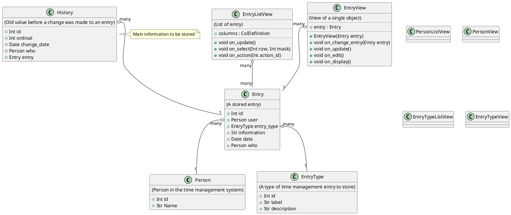
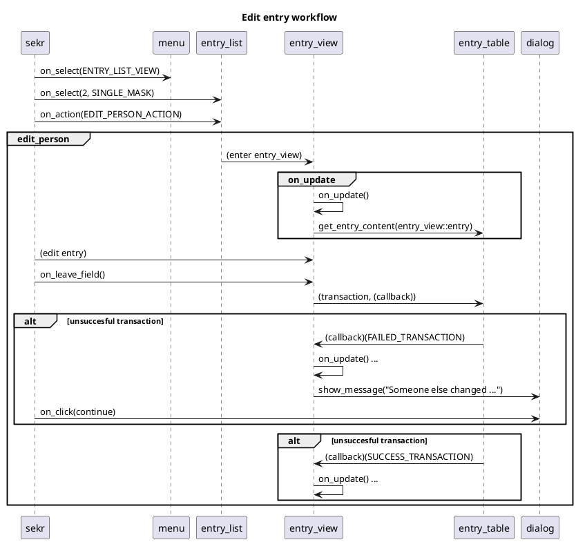
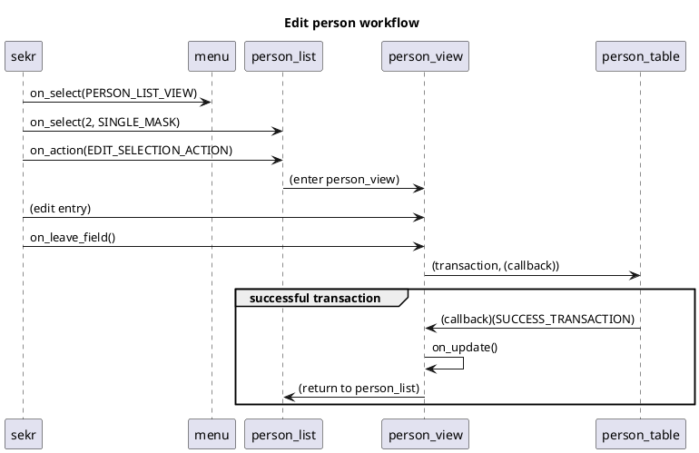
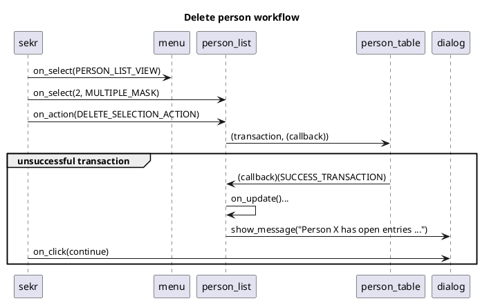
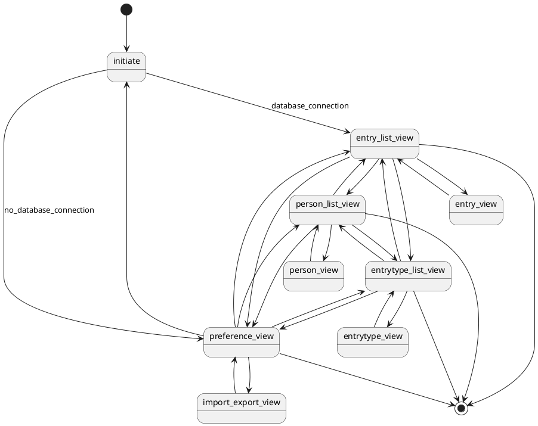

# Sekretariat App

Simple tool to store some information about time management entries that are required at a later time.

## Design

```plantuml
@startuml
class Person{
    (Person in the time management system)
    ..
    +Int id
    +Str Name
}

class EntryType{
    (A type of time management entry to store)
    ..
    +Int id
    +Str label
    +Str description
}

class Entry{
    (A stored entry)
    ..
    +Int id
    +Person user
    +EntryType entry_type
    +Str information
    +Date date
    +Person who
}

class History{
    (Old value before a change was made to an entry)
    ..
    +Int id
    +Int ordinal
    +Date change_date
    +Person who
    +Entry entry
}

History::entry "many" o-- "1" Entry
Entry::user "many" o-- "1" Person
Entry::entry_type "many" o-- "1" EntryType

note right
    Main information to be stored
end note

class EntryListView {
    (List of entry)
    ..
    +columns : ColDefinition
    ..
    +void on_update()
    +void on_select(Int row, Int mask)
    +void on_action(Int action_id)
}

class EntryView {
    (View of a single object)
    ..
    +entry : Entry
    ..
    +EntryView(Entry entry)
    +void on_change_entry(Entry entry)
    +void on_update()
    +void on_edit()
    +void on_display()
}

EntryView::entry "many" o-- "1" Entry
EntryListView "many" o-- "many" Entry

class PersonListView
class PersonView
class EntryTypeListView
class EntryTypeView

@enduml
```

```plantuml
@startuml
title Edit entry workflow
sekr -> menu: on_select(ENTRY_LIST_VIEW)
sekr -> entry_list: on_select(2, SINGLE_MASK)
sekr -> entry_list: on_action(EDIT_PERSON_ACTION)
group edit_person
entry_list -> entry_view: (enter entry_view)
group on_update
entry_view -> entry_view: on_update()
entry_view -> entry_table: get_entry_content(entry_view::entry)
end
sekr -> entry_view: (edit entry)
sekr -> entry_view: on_leave_field()
entry_view -> entry_table: (transaction, (callback))
alt unsuccesful transaction
entry_table -> entry_view: (callback)(FAILED_TRANSACTION)
entry_view -> entry_view: on_update() ...
entry_view -> dialog: show_message("Someone else changed ...")
sekr -> dialog: on_click(continue)
end
alt unsuccesful transaction
entry_table -> entry_view: (callback)(SUCCESS_TRANSACTION)
entry_view -> entry_view: on_update() ...
end
end
@enduml
```

```plantuml
@startuml
title Edit person workflow
sekr -> menu: on_select(PERSON_LIST_VIEW)
sekr -> person_list: on_select(2, SINGLE_MASK)
sekr -> person_list: on_action(EDIT_SELECTION_ACTION)
person_list -> person_view: (enter person_view)
sekr -> person_view: (edit entry)
sekr -> person_view: on_leave_field()
person_view -> person_table: (transaction, (callback))
group successful transaction
person_table -> person_view: (callback)(SUCCESS_TRANSACTION)
person_view -> person_view: on_update()
person_view -> person_list: (return to person_list)
end
@enduml
```

```plantuml
@startuml
title Delete person workflow
sekr -> menu: on_select(PERSON_LIST_VIEW)
sekr -> person_list: on_select(2, MULTIPLE_MASK)
sekr -> person_list: on_action(DELETE_SELECTION_ACTION)
person_list -> person_table: (transaction, (callback))
group unsuccessful transaction
person_table -> person_list: (callback)(SUCCESS_TRANSACTION)
person_list -> person_list: on_update()...
person_list -> dialog: show_message("Person X has open entries ...")
sekr -> dialog: on_click(continue)
end
@enduml
```

```plantuml
@startuml
[*] --> initiate
initiate --> entry_list_view: database_connection
initiate --> preference_view: no_database_connection
initiate <-- preference_view
entry_list_view --> person_list_view
entry_list_view <-- person_list_view
entry_list_view --> entrytype_list_view
entry_list_view <-- entrytype_list_view
entry_list_view --> preference_view
entry_list_view <-- preference_view
person_list_view --> preference_view
person_list_view <-- preference_view
person_list_view --> entrytype_list_view
person_list_view <-- entrytype_list_view
entrytype_list_view <-- preference_view
entrytype_list_view --> preference_view
entry_list_view --> [*]
person_list_view --> [*]
entrytype_list_view --> [*]
preference_view --> [*]
entry_list_view --> entry_view
person_list_view --> person_view
entrytype_list_view --> entrytype_view
entry_list_view <-- entry_view
person_list_view <-- person_view
entrytype_list_view <-- entrytype_view
preference_view --> import_export_view
preference_view <-- import_export_view
@enduml
```
